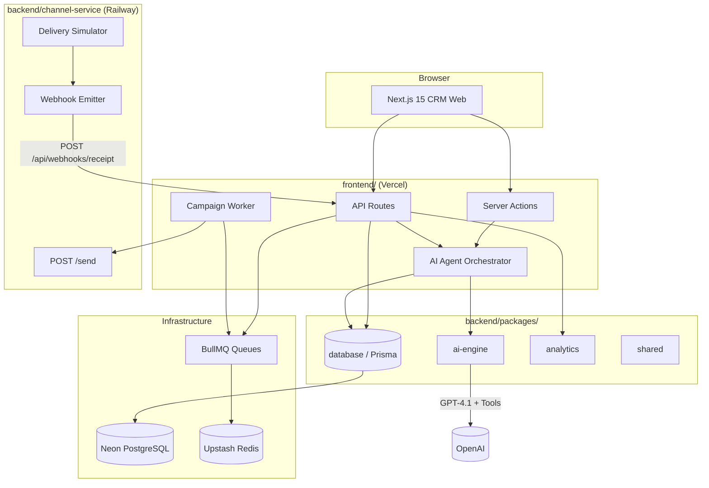
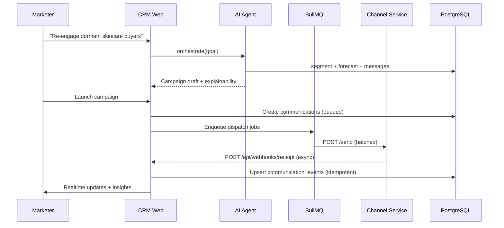
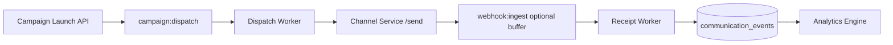
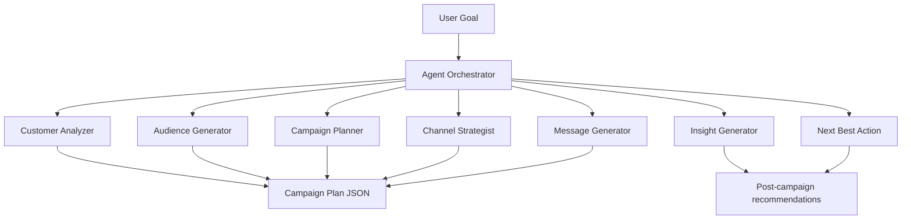

# XenoPilot — System Architecture

> AI-Native Shopper Engagement CRM. Marketers describe goals in natural language; the system orchestrates segmentation, channel selection, campaign generation, execution, and insight generation.

## 1. Architecture Diagram



## 2. Data Flow — Campaign Launch



## 3. Folder Structure

```
xenopilot/
├── apps/
│   ├── crm-web/                 # Next.js 15 — marketer UI + API + workers
│   │   ├── app/
│   │   │   ├── (dashboard)/     # Dashboard, Analytics
│   │   │   ├── copilot/         # AI Command Center
│   │   │   ├── customers/       # Customer intelligence
│   │   │   ├── audiences/       # Audience Studio
│   │   │   ├── campaigns/       # Campaign Center
│   │   │   └── api/             # REST + webhooks
│   │   ├── lib/                 # Server utilities
│   │   └── workers/             # BullMQ campaign worker
│   └── channel-service/         # Standalone delivery simulator
│       └── src/
├── packages/
│   ├── database/                # Prisma schema, client, seed
│   ├── ai-engine/               # Agent tools + orchestrator
│   ├── analytics/               # Funnel, KPIs, insight helpers
│   └── shared/                  # Types, constants, channel rates
├── docs/
│   ├── ARCHITECTURE.md
│   ├── API.md
│   └── ROADMAP.md
├── docker-compose.yml           # Local Postgres + Redis
└── package.json                 # npm workspaces
```

## 4. API Contracts

See [API.md](./API.md) for full OpenAPI-style contracts.

| Service | Endpoint | Purpose |
|---------|----------|---------|
| CRM | `POST /api/agent/chat` | Natural-language goal → orchestrated actions |
| CRM | `GET /api/customers` | Paginated customer list + AI scores |
| CRM | `GET /api/customers/:id` | Profile, orders, campaigns, insights |
| CRM | `POST /api/audiences/generate` | NL → segment definition |
| CRM | `GET /api/audiences` | AI-generated audiences |
| CRM | `POST /api/campaigns` | Create campaign from agent output |
| CRM | `POST /api/campaigns/:id/launch` | Enqueue BullMQ dispatch |
| CRM | `GET /api/analytics/overview` | KPIs, funnel, AI insights |
| CRM | `POST /api/webhooks/receipt` | Idempotent event ingestion |
| CRM | `POST /api/seed` | Generate demo data |
| Channel | `POST /send` | Accept communication for simulation |
| Channel | `GET /health` | Health check |

## 5. Queue Architecture



**Queues**
- `campaign:dispatch` — one job per communication batch (25 concurrency)
- `campaign:complete` — mark campaign completed after all batches

**Rules**
- Controllers never call channel service directly
- Jobs are idempotent via `communicationId` + `eventType` unique constraint
- Retries: 3 attempts, exponential backoff
- Dead letter: failed jobs logged for audit

## 6. AI Orchestration Design



**Tool registry** (packages/ai-engine):
1. `customer_analyzer` — churn, LTV, purchase probability
2. `audience_generator` — NL → Prisma filter + explanation
3. `campaign_planner` — goal → audience + channel + strategy
4. `channel_strategist` — audience → channel + confidence
5. `message_generator` — variants A/B/C per channel
6. `insight_generator` — executive summary from analytics
7. `next_best_action` — win-back, upsell, loyalty suggestions

**LLM path**: OpenAI GPT-4.1 with function calling when `OPENAI_API_KEY` is set; deterministic heuristic fallback for offline demo.

## 7. Scalability Assumptions

| Dimension | Assumption | Design choice |
|-----------|------------|---------------|
| Customers | 100k | Indexed filters on spend, dates, scores |
| Campaigns | 10k | Partition analytics by campaign_id |
| Events | 1M+ | Append-only events, idempotent upsert |
| Dispatch | 50k/min peak | BullMQ workers, batched sends |

**Conscious tradeoffs for assignment scope**
- Event sourcing lite (events table, not full CQRS)
- Single worker process locally; horizontal scale on Railway
- Embeddings deferred to Phase 2 (semantic audience search)

## 8. Deployment Topology

| Component | Platform | Notes |
|-----------|----------|-------|
| crm-web | Vercel | Serverless API + optional worker on Railway |
| channel-service | Railway | Always-on for async simulation |
| PostgreSQL | Neon | Connection pooling via Prisma |
| Redis | Upstash | BullMQ backend |
